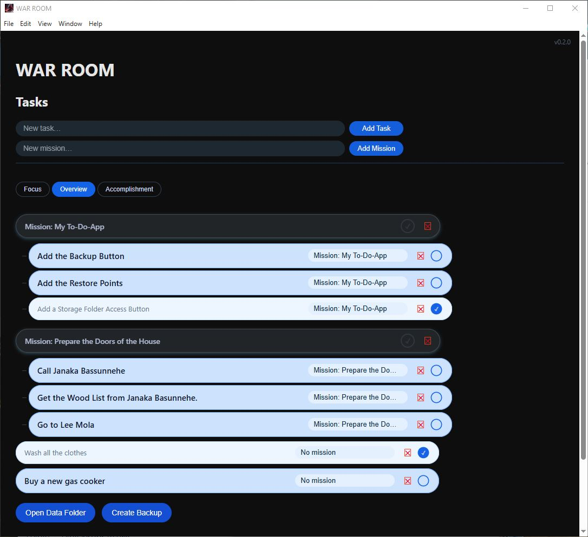

# 🪖 WAR ROOM

WAR ROOM is an **offline‑first desktop task & mission command app** built with **Electron**.

It is designed for people who care about **daily execution** as much as **long‑term missions** — without forcing everything into complex project management systems.

WAR ROOM treats **small tasks** and **big missions** with equal respect.

---

## ✨ Core Philosophy

- 🧠 _One task done is a win_ — whether it’s cooking rice or designing a UI
- 🎯 Missions exist to give direction, not pressure
- 🔒 Offline‑first, local data you fully control
- 🛡️ Safety before features (undo, backups, restore points)

---

## 🚀 Features

### ✅ Tasks & Missions

- Create standalone tasks
- Group tasks under missions
- Missions are completed **only when all tasks are done AND manually confirmed**
- Clear visual distinction between:
  - incomplete
  - eligible for completion
  - completed

### 👁️ Visibility Modes

- Focus mode
- Overview mode
- Accomplishment mode

### 🔄 Undo & Safety

- Undo accidental deletions
- Explicit backup controls
- User‑visible data folder

### 💾 Local‑First Storage

- No internet required
- Data stored safely using Electron `userData`
- Future‑ready for cloud sync (Supabase planned)

---

## 🖼️ Screenshot

> Example UI of WAR ROOM in action



---

## 🛠️ Tech Stack

- **Electron** (desktop framework)
- **Vanilla JavaScript** (no heavy frameworks)
- **HTML / CSS** (custom UI)
- **Node.js** (filesystem & IPC)

---

## 📦 Development Setup

```bash
npm install
npm start
```

### Build Installer

```bash
npm run build
```

---

## 🧭 Roadmap (High Level)

- Restore Points
- Backup Restore UI
- Schema versioning & migrations
- Storage abstraction layer
- Optional cloud sync (Supabase)

---

## 🔐 Data Ownership

WAR ROOM stores **all data locally**.

You can:

- open the data folder directly
- create backups manually
- move or copy your data freely

Nothing is hidden.

---

## 📜 License

MIT License

---

## ✍️ Author

**Moditha Piyumal**  
Self‑taught developer building tools for focus, growth, and independence.

> _“Small wins compound.”_
